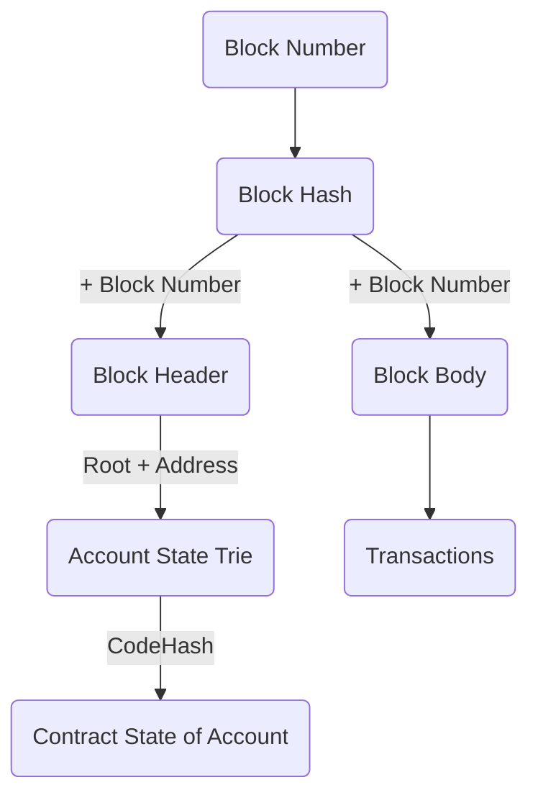

### 引言 
* 最好的以太坊架构介绍莫过于黄皮书和代码本身
    * [Ethereum Yellow Paper][paper]
    * [go-ethereum][code]
* 下面还列举了一些可能有帮助的文档 
    * [Ethereum Frontier Guide](https://ethereum.gitbooks.io/frontier-guide/content/index.html)
    * [Ethereum Wiki](https://github.com/ethereum/wiki/wiki)
    * 待续

### 架构总览
* Lee Thomas 给出了一份很直观的图


`图片来源: https://ethereum.stackexchange.com/questions/268/ethereum-block-architecture`

* 数据存储

以太坊使用leveldb存储数据，block串起来形成chain，每个block由header+body组成，body中主要包含了交易信息（from，to，value）。可以看到header非常轻量，字节数很少，body相对而言会重一些，具体看交易数

```go
type Header struct {
	ParentHash  common.Hash    `json:"parentHash"       gencodec:"required"`
	UncleHash   common.Hash    `json:"sha3Uncles"       gencodec:"required"`
	Coinbase    common.Address `json:"miner"            gencodec:"required"`
	Root        common.Hash    `json:"stateRoot"        gencodec:"required"`
	TxHash      common.Hash    `json:"transactionsRoot" gencodec:"required"`
	ReceiptHash common.Hash    `json:"receiptsRoot"     gencodec:"required"`
	Bloom       Bloom          `json:"logsBloom"        gencodec:"required"`
	Difficulty  *big.Int       `json:"difficulty"       gencodec:"required"`
	Number      *big.Int       `json:"number"           gencodec:"required"`
	GasLimit    uint64         `json:"gasLimit"         gencodec:"required"`
	GasUsed     uint64         `json:"gasUsed"          gencodec:"required"`
	Time        *big.Int       `json:"timestamp"        gencodec:"required"`
	Extra       []byte         `json:"extraData"        gencodec:"required"`
	MixDigest   common.Hash    `json:"mixHash"          gencodec:"required"`
	Nonce       BlockNonce     `json:"nonce"            gencodec:"required"`
}

type Body struct {
	Transactions []*Transaction
	Uncles       []*Header
}
```

除了主链，以太坊还存储账户状态信息、合约状态信息，试想一下假如用户1个亿，合约数量1千万，如果在每个block上记录状态，随着block增多，数据量将会急速膨胀。所以，这部分数据不能直接存储在block中，但是如果不存储在block中，这部分数据又很容易被更改。那怎么办呢？答案是[Merkle Patricia
Tree](https://blog.ethereum.org/2015/11/15/merkling-in-ethereum/)。Tree的rootHash上链，保证难以篡改。当状态需要更新时，将老状态复制一份，在此基础上更新形成新状态维护在最后一个block上，然后可以删除老状态。这样每个客户端只需要维护最新的block上的用户、合约状态，这样就解决了数据量的问题。对于以太坊，状态可以根据block header中的Root字段进行查询到其对应的Merkle Tree。账号的状态是直接记录的。合约的状态会复杂些，需要根据每个用户下的合约执行记录去复盘最终的合约状态（猜测）

下面这段测试代码，可以帮助你简单理解下数据如何存储



```go
package main

import (
	"fmt"
	"github.com/ethereum/go-ethereum/common"
	"github.com/ethereum/go-ethereum/ethdb"
	"encoding/binary"
	"github.com/ethereum/go-ethereum/core/types"
	"bytes"
	"github.com/ethereum/go-ethereum/rlp"
	"github.com/ethereum/go-ethereum/trie"
	"github.com/ethereum/go-ethereum/core/state"
	"github.com/ethereum/go-ethereum/crypto"
)

var (
	headHeaderKey = []byte("LastHeader")
	headBlockKey  = []byte("LastBlock")
	headFastKey   = []byte("LastFast")

	bodyPrefix          = []byte("b")
	blockHashPrefix     = []byte("H")
	headerPrefix        = []byte("h") // headerPrefix + num (uint64 big endian) + hash -> header
	numSuffix           = []byte("n") // headerPrefix + num (uint64 big endian) + numSuffix -> hash
)

func main() {
	db, err := ethdb.NewLDBDatabase("/Users/bing/test/data/geth/chaindata", 768, 1024)
	if nil != err {
		fmt.Println(err)
		return
	}

	headBlockHashData, _ := db.Get(headBlockKey)
	headBlockHash := common.BytesToHash(headBlockHashData);

	headBlockNumData, _ := db.Get(append(blockHashPrefix, headBlockHashData...))
	headBlockNum := binary.BigEndian.Uint64(headBlockNumData)

	fmt.Printf("block Number of hash %x is %d\n", headBlockHash, headBlockNum)

	// Connection to leveldb
	//db, _ := leveldb.OpenFile("/Users/bing/test/data/geth/chaindata", nil)

	//374,327,307,294,287
	//18, contract creation
	for i:=headBlockNum; i > 0; i-- {
		// 40 to bytes (Big endian)
		blockNumber := make([]byte, 8)
		binary.BigEndian.PutUint64(blockNumber, uint64(i))

		fmt.Printf("Details of Blocknumber:- \nHex: %x \nBytes: %d\n\n\n", blockNumber, blockNumber)

		// create key to get hash (headerPrefix + num (uint64 big endian) + numSuffix)
		hashKey := append(headerPrefix, blockNumber...) // adding prefix
		hashKey = append(hashKey, numSuffix...)         // adding suffix

		fmt.Printf("Details of leveldb key for Block Hash:- \nType: %T  \nHex: %x \nbytes: %v \nLength:  %d\n\n\n", hashKey, hashKey, hashKey, len(hashKey))

		// Getting hash using hashKey
		blockHash, _ := db.Get(hashKey)
		fmt.Printf("Details of Block hash:- \nType: %T \nHex: %x \nBytes: %v\n\n\n", blockHash, blockHash, blockHash)

		//Create key to get header (headerPrefix + num (uint64 big endian) + hash)
		headerKey := append(headerPrefix, blockNumber...) // adding prefix
		headerKey = append(headerKey, blockHash...)       // adding suffix

		fmt.Printf("Details of leveldb key for Block Header:- \nType: %T  \nHex: %x \nVytes: %v \nLength:  %d\n\n\n", headerKey, headerKey, headerKey, len(headerKey))

		//get Block Header data from db
		blockHeaderData, _ := db.Get(headerKey)

		fmt.Printf("Details of Raw Block Header:- \nType: %T  \nHex: %x \nBytes: %v \nLength:  %d\n\n\n", blockHeaderData, blockHeaderData, blockHeaderData, len(blockHeaderData))

		//new Blockheader type
		blockHeader := new(types.Header)
		fmt.Printf("Details of new Header Type:- \nType: %T  \nHex: %x \nValue: %v\n\n\n", blockHeader, blockHeader, blockHeader)

		// Read blockHeaderData in a tmp variable
		tmpByteData := bytes.NewReader(blockHeaderData)
		fmt.Printf("Details of tmpByteData:- \nType: %T  \nHex: %x \nValue: %v\n\n\n", tmpByteData, tmpByteData, tmpByteData)

		//Decode tmpByteData to new blockHeader
		rlp.Decode(tmpByteData, blockHeader)
		fmt.Printf("Details of Header for block number:- \nType: %T  \nHex: %x \nValue: %v\n\n\n", blockHeader, blockHeader, blockHeader)

		blockBodyData, _ := db.Get(append(append(bodyPrefix, blockNumber...), blockHash...))
		blockBody := new(types.Body)
		if err = rlp.Decode(bytes.NewReader(blockBodyData), blockBody); err != nil {
			fmt.Println(err)
		}
		fmt.Printf("Details of Body for block number:- \nType: %T  \nHex: %x \nValue: %v\n\n\n", blockBody, blockBody, blockBody)
		if len(blockBody.Transactions) != 0 {
			fmt.Printf("Block with noempty body found: %d\n", i)
			break;
		}
	}


	headBlockHeaderData, _ := db.Get(append(append(headerPrefix, headBlockNumData...), headBlockHashData...))
	headBlockHeader := new(types.Header)
	rlp.Decode(bytes.NewReader(headBlockHeaderData), headBlockHeader);
	fmt.Printf("head block Header: %v\n", headBlockHeader)
	headBlockBodyData, _ := db.Get(append(append(bodyPrefix, headBlockNumData...), headBlockHashData...))
	//headBlockBodyData, _ := db.Get(append(append(bodyPrefix, blockNumber...), blockHash...))
	headBlockBody := new(types.Body)
	err = rlp.Decode(bytes.NewReader(headBlockBodyData), headBlockBody)
	if err != nil {
		fmt.Println(err)
	}
	fmt.Printf("head block Body: %v\n", headBlockBody)

	//trie, err := trie.New(common.StringToHash("0x5891bbf641aaf627dcce8164be0ff9670efeb7bdde188d29134b3a1963ab738a"), trie.NewDatabase(ldb))
	trieSecure, err := trie.NewSecure(headBlockHeader.Root, trie.NewDatabase(db), 120)
	//trieSecure, err := state.NewDatabase(db).OpenTrie(common.HexToHash("0x5a3aa9413dae5b3b87008d8a1e5817a736417d1f70e7351c7a803508134a670c"))
	if nil != err {
		fmt.Println(err)
		return
	}
	addr := common.HexToAddress("0x328c2504e15b05572df94f0df385cf3c4b130879")
	val, err := trieSecure.TryGet(addr[:])
	if nil != err {
		fmt.Println(err)
		return
	}
	//fmt.Printf("%v\n", val)

	var data state.Account
	if err := rlp.DecodeBytes(val, &data); err != nil {
		fmt.Print("Failed to decode state object", ", addr: ", addr, ", err: ", err)
		return
	}
	fmt.Printf("account state: %+v\n", data)
	//fmt.Printf("%x\n", blockHeader.Root)
	fmt.Printf("%x\t%x\n", data.Root, common.BytesToHash(data.CodeHash))
	fmt.Printf("%x\n", crypto.Keccak256(nil))
}
```

### Merkle Patricia Tree
* 同样出自Lee Thomas

* 可以参考[Understanding the ethereum trie
](https://easythereentropy.wordpress.com/2014/06/04/understanding-the-ethereum-trie/)和[demo](https://github.com/ebuchman/understanding_ethereum_trie)

### 未完，待续

---
> 持续学习中，理解可能有误，敬请谅解

> 版权所有，转载请注明来源

[paper]: https://ethereum.github.io/yellowpaper/paper.pdf
[code]: https://github.com/ethereum/go-ethereum
